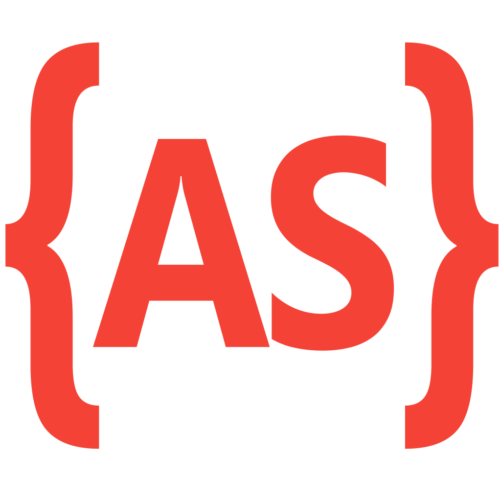

<!-- BACK TO TOP ANCHOR -->

<!-- LOGO -->

  

  <h1 align="center">JBC — Joinville Business Center</h1>

  
A visually immersive corporate website built with Adobe Flash and PHP for Joinville Business Center, featuring an animated office-desk navigation metaphor and a custom-built CMS to convert prospective coworking tenants at business launch.

  
// virtual office · joinville business center

   

  <a href="https://leonardo-vasconcellos.vercel.app/portfolio/jbc"><strong>View it live »</strong></a>

 

<!-- SHIELDS -->

[![Creator Website][website-shield]][website-url]
[![Contributors][contributors-shield]][contributors-url]
[![Forks][forks-shield]][forks-url]
[![Issues][issues-shield]][issues-url]
[![LinkedIn][linkedin-shield]][linkedin-url]
[![Released][year-shield]][year-url]

<!-- TABLE OF CONTENTS -->

  
Table of Contents

  <ol>
    <li><a href="#about-the-project">About The Project</a></li>
    <li><a href="#screenshots">Screenshots</a></li>
    <li><a href="#built-with">Built With</a></li>
    <li><a href="#roadmap">Roadmap</a></li>
    <li><a href="#contributors">Contributors</a></li>
    <li><a href="#contact">Contact</a></li>
  </ol>

<!-- ABOUT THE PROJECT -->
## About The Project

[![Product Screenshot][product-screenshot]](https://leonardo-vasconcellos.vercel.app/portfolio/jbc)

<!-- PROJECT INTRO: 260 chars max -->

Full brand and web launch for Joinville Business Center: Flash animated desk-metaphor navigation plus a PHP CMS so the client could update all five content sections with zero developer involvement.

<!-- END INTRO -->

Joinville Business Center (JBC) was a virtual office and coworking space in Joinville, Santa Catarina, Brazil — one of the earliest operations of its kind in the region. This website was the company's digital presence from its founding in 2006.

The site was a deliberate hybrid: an Adobe Flash shell delivered the brand experience — a fully animated office-desk scene where five sticky notes acted as navigation buttons, each revealing a content panel for Home, Structure, Services, Advantages, and Contacts. Once the intro animation finished, a secondary lateral Flash movie and two transparent iframes loaded the PHP-driven content, keeping the animated shell intact while making page content dynamic and manageable.

The PHP pages were served through a custom CMS built specifically for this project, allowing the JBC team to edit copy across all five sections from a browser interface without modifying code. The WYSIWYG editor (based on InnovaEditor) was integrated directly into the admin back-end.

The entire brand identity — logo, color palette, and typography — was designed alongside the site. Multiple logo iterations (versions 993 through 1202 are archived in the repo) show the refinement process that led to the final mark, which paired a custom typeface with a warm gold-on-dark palette matching the site's aesthetic.

**Key contributions:**

<!-- KEY FEATURES -->
### Key Features

- **Complete brand launch package** — logo, visual identity, and website delivered together, enabling JBC to go to market with a coherent professional presence from day one
- **Self-editable custom CMS** — a hybrid Flash + PHP architecture letting the client update all five content sections without developer involvement, reducing ongoing maintenance cost
- **Memorable animated interface** — an office-desk UI with five sticky-note hotspots (Home, Structure, Services, Advantages, Contacts) that guided visitors through the sales funnel in a single interaction

(<a href="#readme-top">back to top</a>)

<!-- SCREENSHOTS -->
## Screenshots

  
  
  
  
  
  

(<a href="#readme-top">back to top</a>)

<!-- BUILT WITH -->
## Built With

<!-- LANGUAGES -->

**Languages**

|                                                                                                              | Language     | Version |
| ------------------------------------------------------------------------------------------------------------ | ------------ | ------- |
|          | HTML         | 4.01    |
|            | CSS          | 2       |
|              | PHP          | 5       |
|  | JavaScript | ES3     |
|                                                                                                               | ActionScript | 2.0     |
|    | MySQL       | 5.1     |
<!-- FRAMEWORKS & LIBRARIES -->

**Tools & Runtime**

|                                                                                                                | Tool               | Role              |
| -------------------------------------------------------------------------------------------------------------- | ------------------ | ----------------- |
|           | Adobe Flash Player | Animated UI shell |

(<a href="#readme-top">back to top</a>)

<!-- ROADMAP -->
## Roadmap

This project repository is for archive purposes only. No new features or issues are being tracked.

(<a href="#readme-top">back to top</a>)

<!-- CONTRIBUTORS -->
## Contributors

(<a href="#readme-top">back to top</a>)

<!-- CONTACT -->
## Contact

[Leonardo Vasconcellos - Website](https://leonardo-vasconcellos.vercel.app/) — [LinkedIn](https://www.linkedin.com/in/llvasconcellos)

(<a href="#readme-top">back to top</a>)

<!-- MARKDOWN LINKS & IMAGES -->

[website-shield]: https://img.shields.io/badge/Creator_Website-%E2%86%97-2eba7a?style=for-the-badge
[website-url]: https://leonardo-vasconcellos.vercel.app/
[contributors-shield]: https://img.shields.io/github/contributors/llvasconcellos2/jbc.svg?style=for-the-badge
[contributors-url]: https://github.com/llvasconcellos2/jbc/graphs/contributors
[forks-shield]: https://img.shields.io/github/forks/llvasconcellos2/jbc.svg?style=for-the-badge
[forks-url]: https://github.com/llvasconcellos2/jbc/network/members
[issues-shield]: https://img.shields.io/github/issues/llvasconcellos2/jbc.svg?style=for-the-badge
[issues-url]: https://github.com/llvasconcellos2/jbc/issues
[linkedin-shield]: https://img.shields.io/badge/-LinkedIn-0A66C2?style=for-the-badge&logo=linkedin&logoColor=white
[linkedin-url]: https://www.linkedin.com/in/llvasconcellos
[year-shield]: https://img.shields.io/badge/Released-2006-gray?style=for-the-badge
[year-url]: #
[product-screenshot]: screenshots/JOINVILLE%20BUSINESS%20CENTER%20-%20JBC.png
